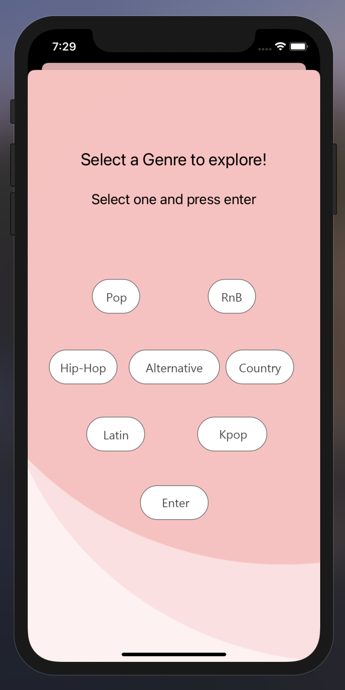
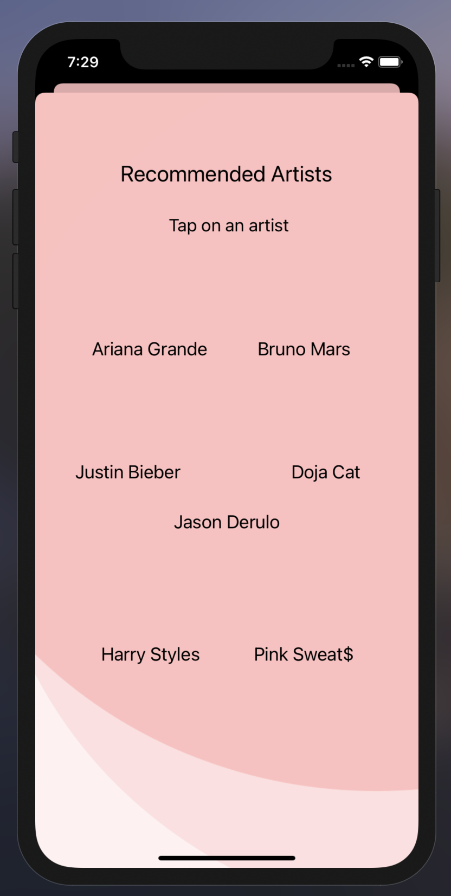
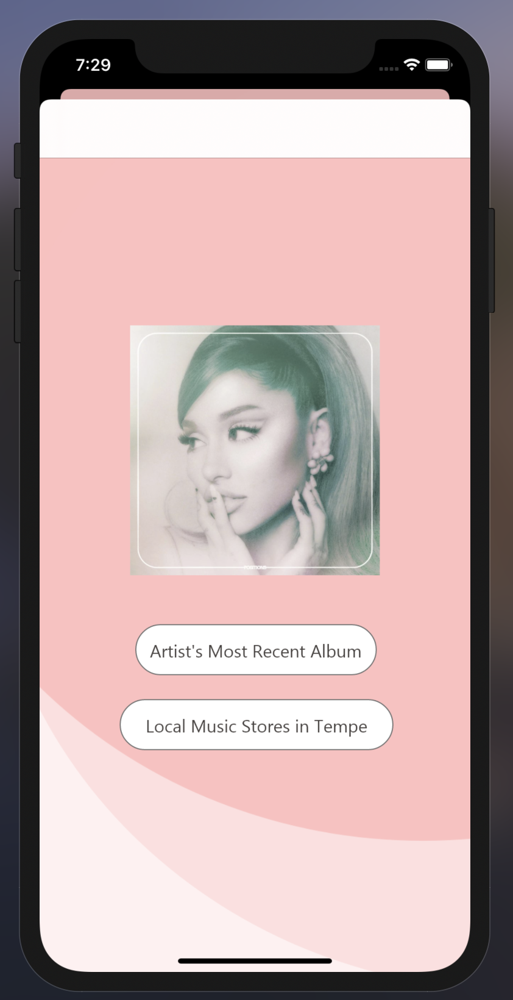
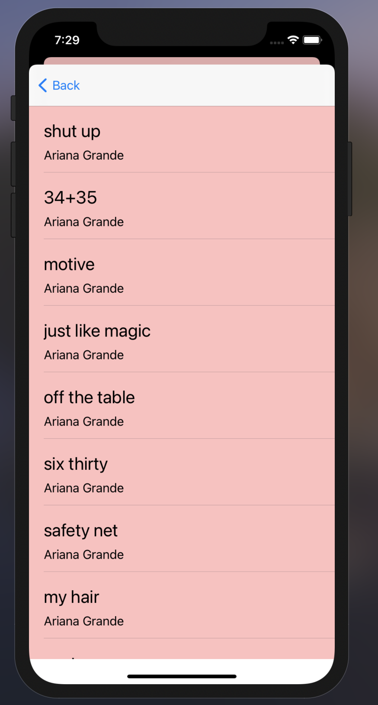

.inline-block {
   display: inline-block;
}

# Music-Recommender-IOS-App
This is my first iOS app. An iOS app that performs api calls to the [AudioDB API](https://www.theaudiodb.com/api_guide.php).

link to demonstration: https://youtu.be/9vzuvE7hqMw

## Description
This app utilizes tableViews, core data, and other Swift functionalities along side a music database API called AudioDB to get information on user selected artist's most recent albums and track listings. A user can select a genre and an associated artist to see the track listing of the artist's most recent ablum.

### Features
* Return all Album details from artist name. Example: [https://www.theaudiodb.com/api/v1/json/1/searchalbum.php?s=daft_punk](https://www.theaudiodb.com/api/v1/json/1/searchalbum.php?s=daft_punk)
* Return single album details from artist + album name. Example: [searchalbum.php?s=daft_punk&a=Homework](https://www.theaudiodb.com/api/v1/json/1/searchalbum.php?s=daft_punk&a=Homework)
* Return All Tracks for Album from known TADB_Album_ID. Example: [track.php?m={albumid}](theaudiodb.com/api/v1/json/1/track.php?m=2115888)
* Uses mapKit to locate the closest music store locations in the Arizona State University area (Tempe, Arizona)
* Uses core data to remember user's most recent search

### App Screenshots

   
  
 

   
  
  
 

 
 ### Usage
 On first use, user will be promted to start and tap on an interested genre. Then tap on an artist to discover. Scroll through the album listing to discover songs by the artist.
 
 ## Built With
* [Xcode - 12.1](https://developer.apple.com/xcode/) - The IDE used
* [Swift - 5.1.4](https://developer.apple.com/swift/) - Programming language

## Author
* Moses Kang
